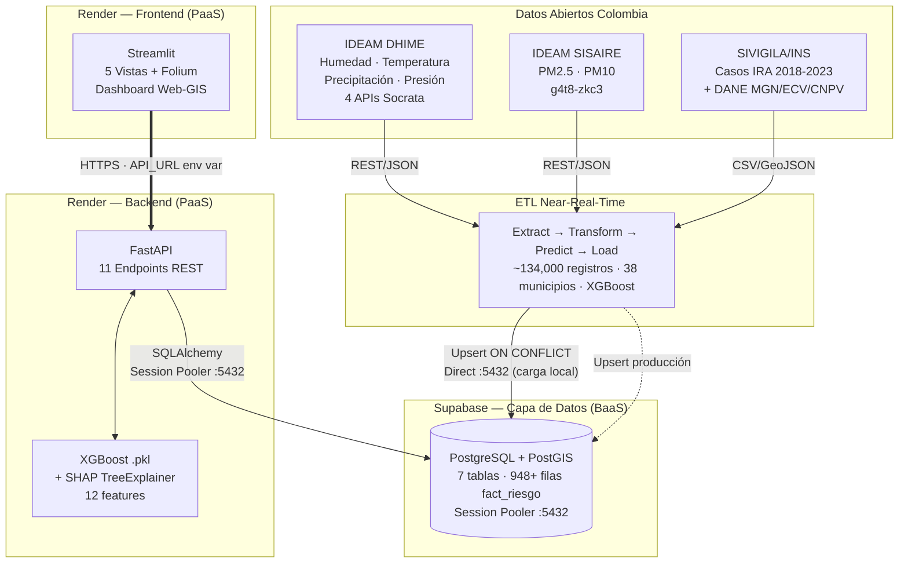

# VitalRisk AI — Sistema de Vigilancia Preventiva Territorial en Salud

[](https://python.org)
[](https://fastapi.tiangolo.com)
[](https://xgboost.ai)
[](https://postgis.net)
[](https://streamlit.io)
[](LICENSE)
[](https://vitalriskia.onrender.com)

> **Equipo 326** | Datos al Ecosistema 2026 — IA para Colombia (MinTIC)  
> Reto: Salud — Innovación Social

---

## 🌐 Demo en producción

| Servicio | URL |
|---|---|
| **Frontend (Dashboard)** | https://vitalriskia-frontend.onrender.com |
| **API REST** | https://vitalriskia.onrender.com |
| **Documentación Swagger** | https://vitalriskia.onrender.com/docs |

> **Nota de carga:** el servicio de Render se duerme tras inactividad. La primera petición puede tardar 30-60 segundos mientras el contenedor se reanuda.

---

## El Problema

Las alertas de salud pública en Colombia son **reactivas**: llegan cuando el brote ya está ocurriendo. No existe un sistema público que integre calidad del aire, epidemiología y datos socioeconómicos para predecir dónde y cuándo ocurrirá el próximo pico de enfermedad respiratoria en Antioquia.

Cada año, las Infecciones Respiratorias Agudas (IRA) generan miles de consultas de urgencias en Antioquia. Los municipios más vulnerables —con alta contaminación por PM2.5, hacinamiento y pobreza— son los más afectados y los que menos capacidad tienen para responder a tiempo.

## La Solución

**VitalRisk AI** predice brotes de IRA con **una semana de anticipación** para los 103 municipios de Antioquia con registro epidemiológico, integrando en tiempo real:

- **Calidad del aire** — PM2.5 y PM10 desde IDEAM SISAIRE (API Socrata `g4t8-zkc3`)
- **Variables meteorológicas** — Humedad, temperatura, precipitación y presión (4 APIs IDEAM DHIME)
- **Epidemiología** — Casos IRA semanales desde SIVIGILA/INS (2018-2023, evento 345)
- **Vulnerabilidad socioeconómica** — ECV Antioquia 2023 (DANE): ICV, NBI, IPM, hacinamiento
- **Demografía** — Proyecciones poblacionales DANE 2018-2042 (denominador de tasas por año)

El sistema calcula un **Índice Preventivo Territorial (IPT)** por municipio y genera alertas preventivas explicables mediante **SHAP**, identificando qué variable ambiental o socioeconómica causó cada alerta.

---

## Resultados del Modelo

| Métrica | Valor | Interpretación |
|---------|-------|----------------|
| **RMSE test** | 1.7399 | Error promedio de 1.74 casos/municipio-semana |
| **MAE test** | 1.0295 | Error absoluto medio de ~1 caso |
| **R² test** | 0.607 | Explica el 60.7% de la varianza en 2022-2023 |
| **Mejora vs Naive** | +16.2% | Supera el baseline de media histórica |
| **Folds CV temporal** | 5 | TimeSeriesSplit — sin data leakage |

Entrenado con **split cronológico estricto**: Train 2018-2020 → Validación 2021 → Test 2022-2023. La variable causal más frecuente en alertas es `pm25_avg` (25.4% de casos según SHAP).

---

## Arquitectura



Ver [`docs/architecture.md`](docs/architecture.md) para el ERD completo de las 7 tablas y el diagrama de pipeline ETL.

---

## Funcionalidades

### 🗺️ Dashboard Territorial
Mapa coroplético de Antioquia (125 municipios) coloreado por IPT (verde/amarillo/rojo) con tooltips interactivos, panel lateral de alertas recientes y 5 KPIs: municipios monitoreados, IPT promedio Antioquia, IPT Valle de Aburrá, alertas activas, PM2.5 promedio.

### 🚨 Alertas Preventivas
Tarjetas semánticas con predicción t+1, desviación porcentual vs media histórica y variable causal (SHAP). Predicción en vivo desde un dropdown —el backend autocompleta las features desde la BD.

### 🔬 Transparencia IA
Métricas del modelo, feature importance (XGBoost gain), validación cruzada temporal, gráfico SHAP beeswarm y justificaciones técnicas de decisiones de diseño (por qué XGBoost y no SARIMAX, por qué RMSE y no AUC-ROC).

### 📦 Portal de Datos Abiertos
Descargas CSV del IPT histórico y alertas, diccionario de datos con 8 variables documentadas y metadatos en formato estándar de observatorios de salud pública.

### ⚡ ETL Near-Real-Time
Pipeline activado por `POST /api/v1/etl/sincronizar` que conecta a 5 APIs Socrata, extrae ~134,000 registros climáticos de los últimos 14 días, los agrega a granularidad municipio × semana epidemiológica, ejecuta XGBoost y hace upsert de predicciones y alertas en Supabase.

---

## Fuentes de Datos Abiertos

| # | Fuente | Dataset ID | Portal | Tipo |
|---|--------|-----------|--------|------|
| 1 | IDEAM — Humedad del aire | [uext-mhny](https://www.datos.gov.co/resource/uext-mhny) | datos.gov.co | API Socrata |
| 2 | IDEAM — Temperatura | [sbwg-7ju4](https://www.datos.gov.co/resource/sbwg-7ju4) | datos.gov.co | API Socrata |
| 3 | IDEAM — Precipitación | [s54a-sgyg](https://www.datos.gov.co/resource/s54a-sgyg) | datos.gov.co | API Socrata |
| 4 | IDEAM — Presión atmosférica | [62tk-nxj5](https://www.datos.gov.co/resource/62tk-nxj5) | datos.gov.co | API Socrata |
| 5 | IDEAM SISAIRE — PM2.5/PM10 | [g4t8-zkc3](https://www.datos.gov.co/resource/g4t8-zkc3) | datos.gov.co | API Socrata |
| 6 | SIVIGILA/INS — Eventos IRA (evento 345) | Archivos anuales 2018-2023 | ins.gov.co | CSV |
| 7 | DANE — ECV Antioquia 2023 | Encuesta de Calidad de Vida | antioquiadatos.gov.co | XLSX |
| 8 | DANE — Proyecciones CNPV 2018 | Población 2018-2042 | dane.gov.co | XLSX |
| 9 | DANE — MGN 2025 | Geometrías municipales | geoportal.dane.gov.co | GeoJSON |

---

## Instalación Local

### Prerrequisitos
- Python 3.12+
- Docker y Docker Compose (para PostgreSQL local)
- Git

### Pasos

> ⚠️ **Seguridad:** nunca escribas contraseñas directamente en el README ni en archivos versionados. Usa siempre el archivo `.env` (incluido en `.gitignore`) o las variables de entorno de tu plataforma de deploy (Render → Environment).

```bash
# 1. Clonar el repositorio
git clone https://github.com/IsaksGir4/VitalRiskIA.git
cd VitalRiskIA

# 2. Entorno virtual
python -m venv venv
source venv/bin/activate        # Linux/Mac
# venv\Scripts\Activate.ps1    # Windows PowerShell

pip install -r backend/requirements.txt
pip install -r frontend/requirements.txt

# 3. Variables de entorno — crear .env en la raíz (NO versionar)
# Copiar .env.example y completar con tus credenciales:
cp .env.example .env
# Las variables necesarias están documentadas en .env.example

# 4. Levantar PostgreSQL + PostGIS (Docker local)
docker-compose up -d db

# 5. Cargar datos históricos en la BD
python etl/load_to_db.py

# 6. Backend (terminal 1)
cd backend
uvicorn main:app --host 0.0.0.0 --port 8000 --reload

# 7. Frontend (terminal 2)
cd frontend
streamlit run app.py

# 8. Ejecutar ETL para datos 2026 (una vez levantado el backend)
# → Abrir http://localhost:8000/docs
# → POST /api/v1/etl/sincronizar?dias_atras=14
```

**Variables de entorno requeridas** (ver `.env.example`):

| Variable | Descripción | Ejemplo local |
|---|---|---|
| `DB_HOST` | Host de la base de datos | `127.0.0.1` |
| `DB_PORT` | Puerto (5433 local, 6543 Supabase Session Pooler) | `5433` |
| `DB_USER` | Usuario de PostgreSQL | — |
| `DB_PASSWORD` | Contraseña (guardar en `.env`, nunca en el código) | — |
| `DB_NAME` | Nombre de la base de datos | — |
| `ENVIRONMENT` | `development` o `production` | `development` |

**URLs locales:**
- Frontend: http://localhost:8501
- API Swagger: http://localhost:8000/docs
- API ReDoc: http://localhost:8000/redoc

> Para validación remota sin Docker, ver [`docs/validacion_guide.md`](docs/validacion_guide.md).

---

## Índice Preventivo Territorial (IPT)

Métrica compuesta (0-100) que mide la **vulnerabilidad estructural** de cada municipio ante brotes respiratorios:

```
IPT = 0.40 × percentil(tasa_ira_100k)
    + 0.30 × percentil(pm25_avg)
    + 0.15 × percentil(ipm_pct)
    + 0.15 × percentil(icv_hacinamiento)
```

| Nivel | Rango IPT | Significado |
|---|---|---|
| **BAJO** | 0 – 33 | Territorio con baja vulnerabilidad acumulada |
| **MEDIO** | 34 – 66 | Vigilancia preventiva recomendada |
| **ALTO** | 67 – 100 | Intervención prioritaria |

El IPT y las alertas son **señales complementarias, no redundantes**: el IPT mide vulnerabilidad estructural (estable semana a semana), las alertas miden desviación de la predicción XGBoost vs la media histórica del municipio (varía cada semana).

### Niveles de alerta

| Nivel | Condición | Percentil histórico | Acción recomendada |
|---|---|---|---|
| 🟢 ALERTA_VERDE | Desviación < 30% | ≤ P92 | Monitoreo rutinario |
| 🟡 ALERTA_NARANJA | 30% ≤ desviación < 60% | P92–P95 | Vigilancia aumentada |
| 🔴 ALERTA_ROJA | Desviación ≥ 60% | > P95 | Intervención recomendada |

Los umbrales se calibraron con el análisis de percentiles del histórico 2018-2023 (excluyendo pandemia) en el notebook NB05.

---

## Estructura del Repositorio

```
VitalRiskIA/
├── README.md                        # Este archivo
├── LICENSE                          # Licencia MIT
├── .gitignore
├── docker-compose.yml               # PostgreSQL + PostGIS (local)
├── RECURSOS/                        # Material de presentación (pitch deck, portada)
│
├── backend/                         # FastAPI + XGBoost + ETL near-real-time
│   ├── Dockerfile                   # Imagen para Render
│   ├── main.py                      # FastAPI con lifespan (precarga XGBoost)
│   ├── requirements.txt
│   ├── utils.py                     # safe_float, safe_int, normalizar_texto
│   ├── api/v1/
│   │   ├── api.py                   # Router central (7 sub-routers)
│   │   └── endpoints/               # health · mapa · alertas · prediccion
│   │                                # opendata · modelo · etl
│   ├── db/
│   │   ├── database.py              # Engine SQLAlchemy + SessionLocal
│   │   └── queries.py               # Queries SQL centralizadas
│   ├── schemas/                     # Pydantic models (prediccion, alertas, opendata)
│   ├── services/
│   │   ├── ml_service.py            # Singleton XGBoost + predict + metadata
│   │   ├── alertas_service.py       # Umbrales NARANJA=30%, ROJA=60%
│   │   ├── geo_service.py           # GeoJSON builder con safe_float
│   │   └── etl_service.py           # Pipeline ETL near-real-time (5 APIs Socrata)
│   └── settings/
│       ├── config.py                # Pydantic Settings + db_url dinámico
│       └── dependencies.py          # get_db() dependency injection
│
├── frontend/                        # Streamlit — 5 vistas
│   ├── Dockerfile                   # Imagen para Render (incluye GeoJSON)
│   ├── app.py                       # Router principal + sidebar
│   ├── config.py                    # API_URL desde env var
│   ├── requirements.txt
│   ├── .streamlit/config.toml       # Tema claro forzado
│   ├── assets/custom.css            # Design system v3 (paleta teal médico)
│   └── views/
│       ├── dashboard.py             # Mapa Folium coroplético + KPIs
│       ├── alertas.py               # Alertas activas + predicción en vivo
│       ├── modelo_ia.py             # Transparencia XGBoost + SHAP
│       └── opendata.py              # Descargas CSV + metadatos
│
├── data/
│   ├── models/
│   │   ├── modelo_xgboost_vitalrisk.pkl   # Artefacto XGBoost (233 KB)
│   │   └── metricas_modelo.json           # RMSE, MAE, R², CV, feature importance
│   ├── processed/                   # 8 CSVs/GeoJSON limpios (outputs ETL notebooks)
│   └── raw/                         # Fuentes originales (no versionadas — ver .gitignore)
│       ├── clima/                   # 7 archivos CSV IDEAM
│       ├── DANE/                    # MGN2025, DIVIPOLA, proyecciones
│       ├── encuesta-calidad-vida-2023/
│       └── sivigila/                # 6 archivos anuales evento 345
│
├── db/
│   └── init.sql                     # Schema PostgreSQL v4 (7 tablas + comentarios)
│
├── etl/
│   └── load_to_db.py                # Carga inicial idempotente (upsert) a PostGIS
│
├── notebooks/                       # Pipeline ASUM-ML completo
│   ├── 01_exploracion_IRA_ESI.ipynb          # HU5+HU6 — SIVIGILA → clean_ira
│   ├── 02_exploracion_clima_ideam_siata.ipynb # HU5+HU6 — IDEAM → clean_calidad_aire
│   ├── 03_exploracion_dane_geometria.ipynb   # HU5+HU6 — DANE/ECV → clean_municipios
│   ├── 04_merge_datos_hu7_hu8.ipynb          # HU7+HU8 — Feature Store
│   ├── 05_correlaciones_analisis.ipynb       # HU9+HU10 — Correlaciones + Winsorización
│   ├── 06_calculoIPT_justificacion.ipynb     # HU11 — IPT con percentiles ponderados
│   ├── 07_feature_engineering_slpt.ipynb     # HU12+HU13 — XGBoost, 7 modelos comparados
│   └── 08_shap_alertas.ipynb                 # HU14+HU15 — SHAP + motor de alertas
│
├── docs/
│   ├── architecture.md              # Diagrama cloud + ERD 7 tablas (Mermaid)
│   ├── data_dictionary.md           # Diccionario completo de variables
│   ├── fuentes_datos.md             # APIs y archivos con URLs directas
│   ├── conclusiones.md              # Hallazgos del modelo + limitaciones honestas
│   ├── validacion_guide.md          # Guía de reproducibilidad para evaluadores
│   └── arquitecture/                # ADRs
│       ├── ADR-001-Arquitectura-Base.md
│       ├── ADR-002-EvoDatos-Modelo-Metodologia.md
│       └── ADR-003-Validacion-Seleccion-Resultado.md
│
└── tests/                           # Pruebas automatizadas
    ├── test_data_quality.py         # Calidad del Feature Store
    └── test_model_inference.py      # Inferencia XGBoost
```

---

## Metodología — ASUM-ML

El proyecto siguió **ASUM-ML** (Analytics Solutions Unified Method for Machine Learning), documentado en los tres ADRs:

| Fase ASUM-ML | Notebooks / Artefactos | HUs | Resultado clave |
|---|---|---|---|
| **Analyze** — entender el negocio y los datos | NB01 `01_exploracion_IRA_ESI` · NB02 `02_exploracion_clima_ideam_siata` · NB03 `03_exploracion_dane_geometria` | HU5 + HU6 | 3 datasets limpios · 125 municipios · 919 registros IRA · 12,354 registros clima |
| **Design** — diseñar el Feature Store | NB04 `04_merge_datos_hu7_hu8` · NB05 `05_correlaciones_analisis` | HU7 + HU8 + HU9 + HU10 | Feature Store 910 filas × 34 features · correlación lag1 r=0.852 · winsorización p1-p99 |
| **Configure** — modelo e IPT | NB06 `06_calculoIPT_justificacion` · NB07 `07_feature_engineering_slpt` | HU11 + HU12 + HU13 | IPT por percentiles ponderados · 6 métodos de selección de features · 7 modelos comparados · XGBoost seleccionado |
| **Build** — alertas + API | NB08 `08_shap_alertas` · `backend/` completo | HU14 + HU15 + HU16-18 | SHAP TreeExplainer · 845+ alertas · 11 endpoints REST · ETL near-real-time |
| **Deploy** — nube | `Dockerfile` backend + frontend · Render + Supabase | HU19-22 | `vitalriskia.onrender.com` operativo · Supabase PostgreSQL gestionado |
| **Operate** — tiempo real | `etl_service.py` · `POST /etl/sincronizar` | Continuo | 38 municipios actualizados · ~134,000 registros/semana · PM2.5 desde histórico BD |

---

## Equipo 326

| Rol | Integrante | Universidad |
|-----|-----------|-------------|
| Scrum Master / Lead Developer | Isaac Camilo Giraldo Gómez | EIA — Ing. Administrativa + Ing. Sistemas |
| Product Owner / Data Engineer | Luisa Fernanda Giraldo Zuluaga | Simon Bolivar — Ing. Biomédica |

---

## Licencia

Este proyecto está bajo la [Licencia MIT](LICENSE). Todos los datos utilizados son de dominio público bajo la política de datos abiertos de Colombia (Ley 1712 de 2014).

---

*VitalRisk AI — Porque la salud pública no debería ser reactiva.*  
*Equipo 326 | Datos al Ecosistema 2026 — MinTIC / Colombia Digital*