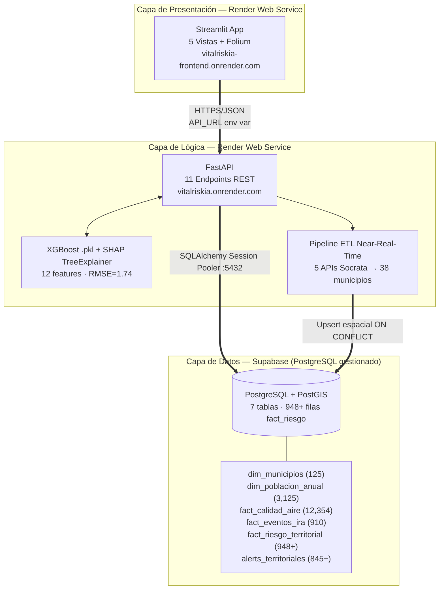
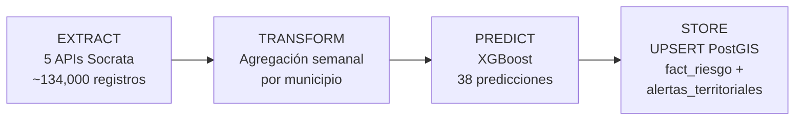
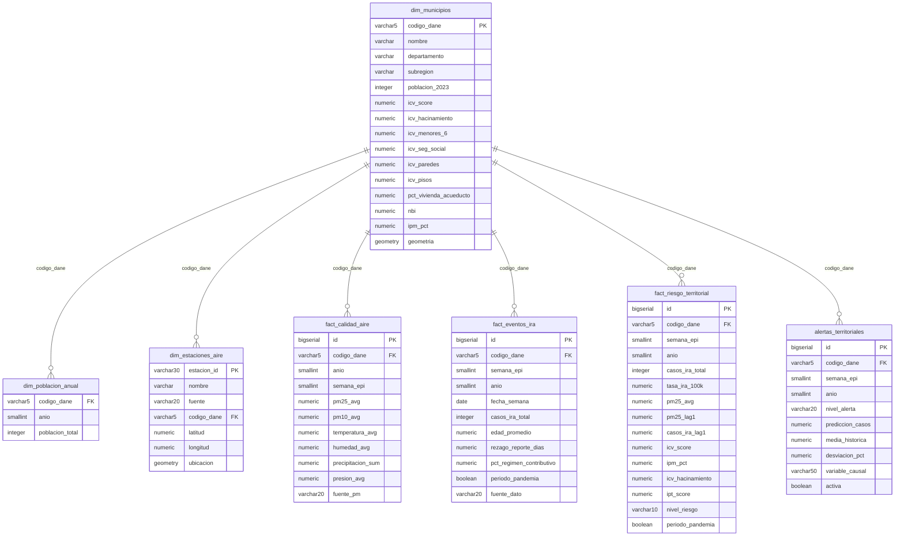

# Arquitectura del Sistema — VitalRisk AI

## Visión General

VitalRisk AI sigue una arquitectura de **tres capas desacopladas** desplegadas en servicios cloud, con comunicación vía REST:



## Decisiones de Arquitectura (ADRs)

| Decisión | Elegido | Descartado | Razón |
|---|---|---|---|
| Backend | FastAPI | Flask | Validación Pydantic, ASGI asíncrono, OpenAPI automático |
| Base de datos | PostgreSQL+PostGIS (Supabase) | MongoDB | JOINs espaciales nativos, SQL estándar para queries analíticas |
| Modelo | XGBoost | SARIMAX, Random Forest, Ridge | 103 series simultáneas, 12 features multivariadas, nulos nativos |
| Orquestación | Docker Compose (local) + Render PaaS (prod) | Kubernetes | MVP en 3 meses con 2 personas |
| Frontend | Streamlit | React | Velocidad de desarrollo, componentes geoespaciales nativos |

Ver ADR-001, ADR-002, ADR-003 para justificaciones detalladas.

## Topología de Conexiones en Producción

```
Local (desarrollo):
  ETL / load_to_db.py  ──→  Supabase :5432 (Direct Connection)
  uvicorn backend      ──→  Supabase :5432 (Session Pooler)

Producción (Render):
  Frontend Streamlit   ──→  API_URL=https://vitalriskia.onrender.com
  FastAPI backend      ──→  Supabase :5432 (Session Pooler via env vars Render)
```

**Nota sobre Session Pooler:** FastAPI usa PgBouncer vía Supabase Session Pooler (puerto 6543) para conexiones de baja latencia. El ETL de carga inicial usa Direct Connection (puerto 5432) para transacciones pesadas sin restricciones de prepared statements.

## Pipeline ETL Near-Real-Time



Activación: `POST /api/v1/etl/sincronizar?dias_atras=14`

## Esquema de Base de Datos (init.sql v4)



**Nota:** `dim_estaciones_aire` está reservada para datos SIATA (radicado 021682, pendiente). Actualmente vacía — los datos ambientales se agregaron a nivel municipio-semana en el NB02 mediante spatial join.

## Seguridad y Ética

- **Datos anonimizados:** no hay datos individuales de pacientes. Todo está agregado a nivel municipal por semana epidemiológica.
- **Sin PII:** sin nombres, cédulas ni historias clínicas.
- **Datos abiertos:** todas las fuentes son de dominio público bajo la política de datos abiertos de Colombia.
- **Transparencia algorítmica:** SHAP explica cada predicción. El usuario puede ver qué variable causó cada alerta.
- **Limitación documentada:** SIVIGILA no tiene API pública con datos 2025-2026. El modelo usa media histórica como proxy. Las alertas reflejarán desviaciones reales cuando existan datos SIVIGILA recientes.