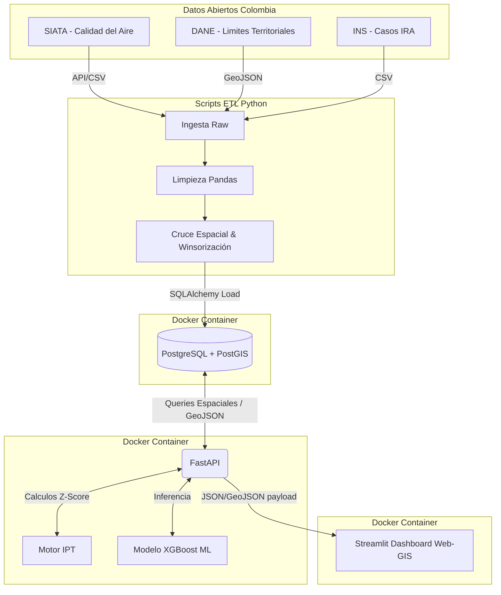

# ADR 001: Arquitectura Base y Flujo de Datos para VitalRisk AI

**Fecha:** 1 de Junio de 2026  
**Estado:** Aceptado  
**Autores:** Equipo de Desarrollo VitalRisk AI  

## 1. Contexto
El proyecto VitalRisk AI busca consolidar datasets de múltiples fuentes oficiales (SIATA, DANE, SIVIGILA/INS, Datos.gov.vo) para generar un Índice Preventivo Territorial (IPT) de riesgo respiratorio en Colombia. Necesitamos definir las tecnologías base para la persistencia de datos (ETL), la creación de la API y la visualización, considerando que disponemos de un tiempo de desarrollo de 10 semanas (MVP).

## 2. Decisión Arquitectónica y Justificaciones

### 2.1 Backend: FastAPI sobre Flask
Se ha decidido utilizar **FastAPI** como framework para la capa de servicios web, descartando alternativas tradicionales como Flask.
* **Justificación:** FastAPI incluye validación nativa de datos mediante Pydantic, lo cual es crítico para asegurar la calidad del dato que entra y sale hacia los modelos predictivos. Además, su naturaleza asíncrona (ASGI) maneja mejor las peticiones de mapas interactivos, y genera automáticamente documentación OpenAPI/Swagger (vital para cumplir nuestra Epica 7 de defensa del proyecto).

### 2.2 Base de Datos: PostgreSQL/PostGIS sobre MongoDB
Se ha decidido utilizar **PostgreSQL con la extensión PostGIS** como motor de base de datos principal, descartando bases de datos NoSQL como MongoDB.
* **Justificación:** Nuestro sistema requiere cruzar datos epidemiológicos con polígonos territoriales (municipios) del DANE y coordenadas del SIATA. PostGIS permite realizar "Spatial Joins" (uniones geoespaciales) de forma nativa e incluye algoritmos de simplificación (Douglas-Peucker) directamente en SQL. MongoDB carece de la madurez y eficiencia relacional requerida para modelos de series temporales combinados con geometrías complejas.

## 3. Diagrama de Flujo de Datos (C4 - Nivel Contenedor)

El siguiente diagrama ilustra el flujo de información, desde las fuentes crudas hasta el usuario final.

### Consecuencias
* **Positivas:** Aseguramos integridad relacional, alto rendimiento en peticiones espaciales y un entorno altamente tipado gracias a FastAPI.

* **Riesgos:** La curva de aprendizaje de consultas SQL espaciales (PostGIS) puede ser más alta inicialmete, lo cual mitigaremos apoyándonos en la documentación oficial y herramientas como GeoAlchemy.