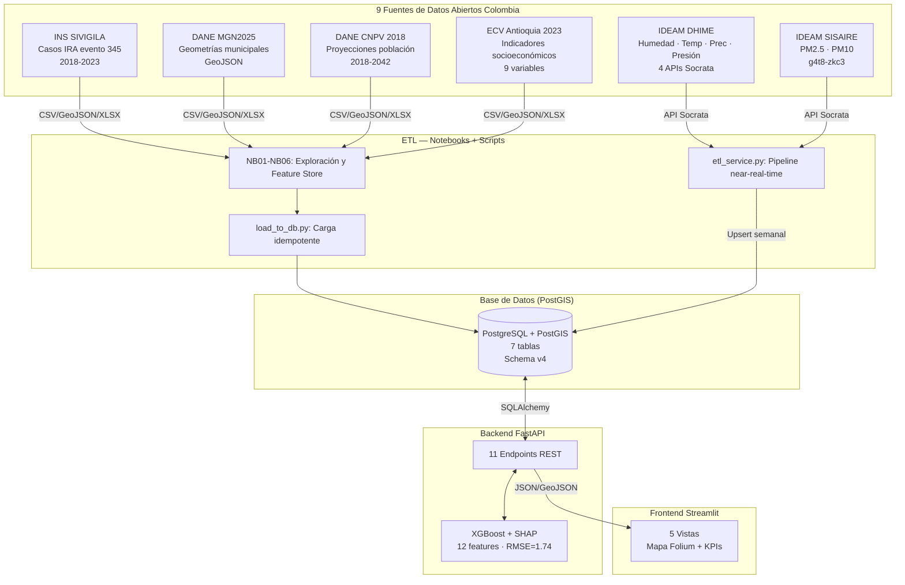

# ADR 001: Arquitectura Base y Flujo de Datos para VitalRisk AI

**Fecha:** 1 de Junio de 2026
**Estado:** Aceptado — actualizado 12 julio 2026 (ver sección 4)
**Autores:** Equipo de Desarrollo VitalRisk AI

---

## 1. Contexto

El proyecto VitalRisk AI busca consolidar datasets de múltiples fuentes oficiales de Colombia para generar un Índice Preventivo Territorial (IPT) de riesgo respiratorio y predecir brotes de IRA con una semana de anticipación. Necesitamos definir las tecnologías base para la persistencia de datos, la API y la visualización, en un horizonte de 10 semanas de desarrollo con un equipo de 2 personas.

---

## 2. Decisiones Arquitectónicas y Justificaciones

### 2.1 Backend: FastAPI sobre Flask

Se decidió utilizar **FastAPI** como framework para la capa de servicios web.

**Justificación:** FastAPI incluye validación nativa de datos mediante Pydantic (crítico para asegurar la calidad del dato que entra y sale hacia los modelos predictivos), su naturaleza asíncrona (ASGI) maneja mejor las peticiones de mapas interactivos, y genera automáticamente documentación OpenAPI/Swagger (requisito explícito de la Épica 7 de defensa del proyecto).

### 2.2 Base de Datos: PostgreSQL/PostGIS sobre MongoDB

Se decidió utilizar **PostgreSQL con la extensión PostGIS** como motor principal.

**Justificación:** El sistema requiere cruzar datos epidemiológicos con polígonos territoriales (municipios) del DANE y coordenadas de estaciones IDEAM. PostGIS permite realizar spatial joins de forma nativa e incluye algoritmos de simplificación geométrica (Douglas-Peucker / `ST_Simplify`) directamente en SQL. MongoDB carece de la madurez relacional requerida para modelos de series temporales combinados con geometrías complejas.

### 2.3 Modelo: XGBoost sobre SARIMAX

Se decidió utilizar **XGBoost** para la predicción de casos IRA.

**Justificación documentada en ADR-003:** 103 series temporales simultáneas con 12 features multivariadas. SARIMAX es univariado y no captura interacciones PM2.5 × hacinamiento. XGBoost maneja nulos nativamente (`tree_method='hist'`), necesario dado que 30-36% de los datos ambientales son NaN por cobertura parcial de estaciones.

### 2.4 Frontend: Streamlit sobre React

Se decidió utilizar **Streamlit** para el dashboard.

**Justificación:** Velocidad de desarrollo para un equipo de 2 personas en 10 semanas. Componentes geoespaciales nativos (Folium, streamlit-folium). Suficiente para el MVP del concurso.

---

## 3. Diagrama de Flujo de Datos (C4 — Nivel Contenedor)

```mermaid
graph TD
    subgraph Fuentes ["9 Fuentes de Datos Abiertos Colombia"]
        A1["IDEAM DHIME\nHumedad · Temp · Prec · Presión\n4 APIs Socrata"]
        A2["IDEAM SISAIRE\nPM2.5 · PM10\ng4t8-zkc3"]
        A3["INS SIVIGILA\nCasos IRA evento 345\n2018-2023"]
        A4["DANE MGN2025\nGeometrías municipales\nGeoJSON"]
        A5["DANE CNPV 2018\nProyecciones población\n2018-2042"]
        A6["ECV Antioquia 2023\nIndicadores socioeconómicos\n9 variables"]
    end

    subgraph ETL ["ETL — Notebooks + Scripts"]
        B1["NB01-NB06: Exploración y Feature Store"]
        B2["load_to_db.py: Carga idempotente"]
        B3["etl_service.py: Pipeline near-real-time"]
    end

    subgraph DB ["Base de Datos (PostGIS)"]
        C1[("PostgreSQL + PostGIS\n7 tablas\nSchema v4")]
    end

    subgraph Backend ["Backend FastAPI"]
        D1["11 Endpoints REST"]
        D2["XGBoost + SHAP\n12 features · RMSE=1.74"]
        D1 <--> D2
    end

    subgraph Frontend ["Frontend Streamlit"]
        E1["5 Vistas\nMapa Folium + KPIs"]
    end

    A1 & A2 -->|"API Socrata"| B3
    A3 & A4 & A5 & A6 -->|"CSV/GeoJSON/XLSX"| B1
    B1 --> B2 --> C1
    B3 -->|"Upsert semanal"| C1
    C1 <-->|"SQLAlchemy"| D1
    D1 -->|"JSON/GeoJSON"| E1
```

---

## 4. Actualización de Infraestructura a Producción (julio 2026)

Durante la Épica 6 (QA y Despliegue), la arquitectura local se migró a servicios cloud manteniendo las decisiones técnicas del ADR sin cambios:

| Componente | Desarrollo local | Producción |
|---|---|---|
| Base de datos | Docker PostgreSQL+PostGIS `:5433` | **Supabase** (PostgreSQL gestionado, Session Pooler `:5432`) |
| Backend API | `uvicorn` local `:8000` | **Render Web Service** — `vitalriskia.onrender.com` |
| Frontend | `streamlit run` local `:8501` | **Render Web Service** — `vitalriskia-frontend.onrender.com` |

**Topología de conexiones:**
- ETL / carga local → Supabase Direct Connection `:5432`
- FastAPI en Render → Supabase Session Pooler `:5432` (vía variables de entorno Render)
- Frontend → Backend vía `API_URL` env var (`https://vitalriskia.onrender.com`)

---

## 5. Consecuencias

**Positivas:** integridad relacional garantizada, alto rendimiento en peticiones espaciales, entorno tipado con Pydantic, despliegue reproducible con Docker Compose localmente y Render en producción.

**Riesgos y mitigaciones:**
- Curva de aprendizaje de PostGIS: mitigada con GeoAlchemy2 y queries centralizadas en `db/queries.py`.
- Cold start en Render (plan gratuito): el servicio se pausa tras inactividad. Primera petición tarda ~60s.
- Session Pooler de Supabase no soporta prepared statements avanzados: SQLAlchemy configurado con transacciones compatibles con PgBouncer.