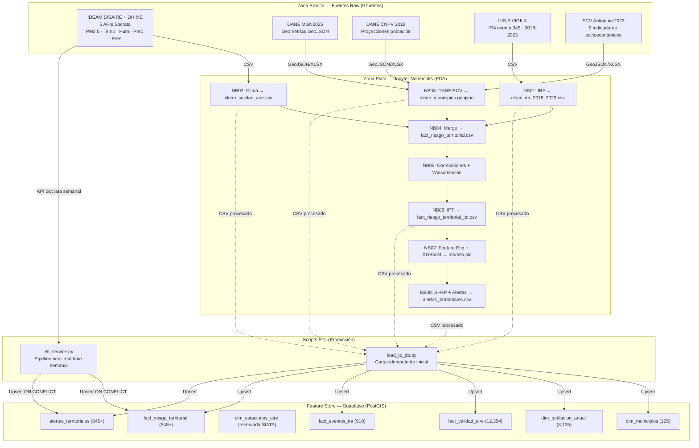

# ADR 002: Evolución del Ecosistema de Datos, Modelado PostGIS y Metodología ASUM-ML

**Fecha:** 13 de Junio de 2026
**Estado:** Aceptado — actualizado 12 julio 2026 (secciones 2.3 y 4)
**Autores:** Equipo de Desarrollo VitalRisk AI
**Relación:** Complementa ADR-001 (Arquitectura Base)

---

## 1. Contexto

Durante el Sprint 2, la complejidad de las fuentes pasó de 3 fuentes genéricas a 9 fuentes específicas con formatos heterogéneos (APIs Socrata horarias, archivos XLSX con 520k filas, GeoJSON con geometrías MultiPolygon). Se necesita establecer un flujo que separe la **exploración científica (EDA)** de la **automatización productiva (ETL)** y que gestione los riesgos de cobertura parcial de datos ambientales.

---

## 2. Decisiones Arquitectónicas y Justificaciones

### 2.1 Metodología: ASUM-ML

Se adoptó **ASUM-ML** (Analytics Solutions Unified Method for Machine Learning) como marco de trabajo para el ciclo de vida del proyecto, dividiendo el trabajo en dos entornos físicos:

**Entorno de descubrimiento (EDA):** 8 Jupyter Notebooks (`NB01`–`NB08`) donde se prototipa, explora y valida cada decisión antes de productivizarla. Los notebooks son entregables científicos con outputs guardados.

**Entorno productivo (ETL):** scripts Python modulares (`load_to_db.py`, `etl_service.py`) que implementan la lógica validada en los notebooks de forma determinista, reproducible y sin supervisión humana.

**Justificación:** previene que código exploratorio llegue a producción. Garantiza que el pipeline ETL sea testeable con pytest y que los notebooks sean reproducibles de forma independiente para el jurado del concurso.

**Mapeo de fases ASUM-ML al proyecto:**

| Fase | Artefactos | HUs | Resultado |
|---|---|---|---|
| Analyze | NB01 · NB02 · NB03 | HU5 + HU6 | 3 datasets limpios · 125 municipios |
| Design | NB04 · NB05 | HU7–HU10 | Feature Store 910 filas × 34 features |
| Configure | NB06 · NB07 | HU11–HU13 | IPT · XGBoost RMSE=1.74 |
| Build | NB08 · backend/ | HU14–HU18 | 845+ alertas · 11 endpoints REST |
| Deploy | Render + Supabase | HU19–HU22 | URL pública operativa |
| Operate | etl_service.py | Continuo | 38 municipios/semana near-real-time |

### 2.2 Modelado Analítico: Feature Store Desnormalizado

La base de datos PostGIS no sigue 3NF estricta. Se usa un esquema de 7 tablas (2 dimensiones + 1 catálogo + 4 hechos/analítica):

- **Dimensiones:** `dim_municipios`, `dim_poblacion_anual`, `dim_estaciones_aire`
- **Hechos:** `fact_calidad_aire`, `fact_eventos_ira`, `fact_riesgo_territorial`, `alertas_territoriales`

**Justificación:** velocidad de lectura prioritaria sobre normalización. `dim_poblacion_anual` separada para calcular `tasa_ira_100k` con el denominador correcto de **cada año histórico** (no solo 2023).

### 2.3 Estrategia de Contingencia de Fuentes (Plan B — ejecutado)

El SIATA no respondió el radicado 021682 antes del deadline. El Plan B fue ejecutado en su totalidad:

| Variable | Fuente Plan B | Cobertura | Estado |
|---|---|---|---|
| PM2.5/PM10 2020-2023 | SISAIRE granulado (`g4t8-zkc3`) | 84 estaciones Antioquia | ✅ Directo |
| PM2.5/PM10 2018-2019 | Promedio Anual IDEAM (`kekd-7v7h`) | 39 municipios | ✅ Imputado |
| Temperatura | DHIME IDEAM (`sbwg-7ju4`) | 35 estaciones | ✅ Directo |
| Humedad | DHIME IDEAM (`uext-mhny`) | 35 estaciones | ✅ Directo |
| Precipitación | DHIME IDEAM (`s54a-sgyg`) | 62 estaciones | ✅ Directo |
| Presión atmosférica | DHIME IDEAM (`62tk-nxj5`) | 16 estaciones | ✅ Directo |

El pipeline near-real-time (`etl_service.py`) está preparado para integrar datos SIATA sin cambios de código cuando estén disponibles.

---

## 3. Diagrama de Flujo de Datos Actualizado (Pipeline ASUM-ML)

---

## 4. Consecuencias

**Positivas:** separación clara entre exploración y producción. Schema de 7 tablas alineado exactamente con los datos reales procesados. Riesgo de exceder el límite de datasets del concurso mitigado (9 fuentes agrupadas en 5 APIs + 4 archivos estáticos). Pipeline near-real-time operativo en producción.

**Riesgos y mitigaciones:**
- Schema drift entre notebooks y scripts: mitigado con `UNIQUE` constraints en las 3 tablas de hechos y pytest de integridad.
- Cobertura parcial de estaciones (38/103 municipios): documentado en `conclusiones.md`. XGBoost maneja nulos nativamente.
- SIVIGILA sin API 2026: mitigado usando media histórica municipal como proxy en el ETL near-real-time.