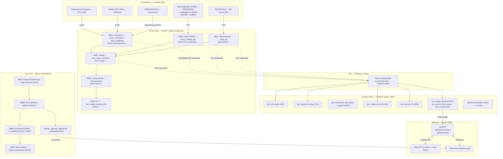

# ADR-003: Validación del Ecosistema de Datos, Selección del Modelo XGBoost y Resultados del Pipeline ASUM-ML

**Fecha:** 1 de Julio de 2026  
**Estado:** Aceptado  
**Autores:** Equipo de Desarrollo VitalRisk AI  
**Relación:** Complementa ADR-001 (Arquitectura Base) y ADR-002 (Ecosistema de Datos)  
**Metodología:** ASUM-ML (Analytics Solutions Unified Method for Machine Learning)  
**Sprint:** Sprint 3 — Épicas 2 y 3 completadas  
**Carry-over:** 8 días desde el 23 de junio de 2026  
**Deadline:** 13 de julio de 2026 (quedan Épicas 4, 5, 6, 7)

---

## 1. Contexto

Este ADR documenta las decisiones arquitectónicas tomadas durante la ejecución de las Épicas 2 y 3. Cubre el trabajo realizado entre el 13 de junio y el 1 de julio de 2026, período en el que se completaron los notebooks NB01 a NB05, la construcción del Feature Store, la carga en PostGIS, el análisis de correlaciones y la winsorización.

El ADR-002 estableció la estructura del pipeline y las fuentes de datos. Este ADR-003 documenta lo que realmente ocurrió al ejecutar ese pipeline: qué datos se encontraron, qué decisiones se tomaron en tiempo de ejecución, qué resultados se obtuvieron, y por qué XGBoost es el algoritmo correcto para este problema.

**Cambio de alcance crítico:** el sistema cubrirá los 125 municipios del departamento de Antioquia (no solo los 10 del Valle de Aburrá como se planteó inicialmente).

---

## 2. Cambios Respecto al ADR-002

### 2.1 Ampliación de Cobertura Territorial

El ADR-002 planteaba foco en el Valle de Aburrá (10 municipios). Durante la exploración se amplió a los 125 municipios de Antioquia.

**Justificación:** Los municipios rurales representan una carga diferencial de IRA (menor acceso a salud, mayor hacinamiento, menor cobertura de acueducto). Un modelo entrenado con 125 municipios generaliza mejor y tiene mayor impacto territorial ante el jurado del concurso, ademas al realizar el analisis de calidad de vida territorial, se encuentra una particularidad sore un buen nivel en la zona, pero queda bastante desproporcionada hacia zonas de otras regiones.

**Consecuencia en datos:** la cobertura de datos climáticos cae a 67-70% para temperatura y PM2.5. Los municipios sin estación propia reciben valores interpolados por vecino espacial más cercano (documentado en NB02).

### 2.2 Confirmación del Plan B IDEAM

Al cierre de este ADR el SIATA no ha respondido el radicado 021682. El Plan B (fuentes fragmentadas del IDEAM) fue ejecutado en su totalidad.

| Fuente | Variables | Cobertura temporal | Estaciones Antioquia |
|---|---|---|---|
| SISAIRE/IDEAM granulado | PM2.5, PM10 | 2020-2023 | 84 estaciones PM |
| IDEAM PA (promedio anual) | PM2.5, PM10 | 2011-2024 | 39 municipios |
| DHIME/IDEAM | Temperatura | 2018-2023 | 35 estaciones |
| DHIME/IDEAM | Humedad del aire | 2018-2023 | 35 estaciones |
| DHIME/IDEAM | Precipitación | 2018-2023 | 62 estaciones |
| DHIME/IDEAM | Presión atmosférica | 2018-2023 | 16 estaciones |
| INS/SIVIGILA | Casos IRA (evento 345) | 2018-2023 | 103 municipios |
| DANE MGN2025 | Geometrías municipales | Estático | 125 municipios |
| ECV Antioquia 2023 | Indicadores socioeconómicos | Estático 2023 | 125 municipios |
| DANE CNPV 2018 | Proyecciones poblacionales | 2018-2023 | 125 municipios |

### 2.3 Granularidad de fact_eventos_ira

El init.sql original diseñó fact_eventos_ira para registros individuales de pacientes. Se cambió a granularidad semanal agregada (1 fila = municipio × semana), alineando la tabla con los demás datasets y eliminando datos sensibles de pacientes.

---

## 3. Resultados por Notebook — Pipeline ASUM-ML

### 3.1 NB01 — Exploración IRA/ESI (HU5 + HU6)

**Fuente:** 6 archivos SIVIGILA (2018-2023). 4,478 registros individuales para Antioquia.

**Hallazgos:**
- Distribución de edad sesgada hacia primera infancia (0-5 años). Epidemiológicamente correcto.
- Comportamiento bimodal en semanas epidemiológicas: picos en semanas 10-15 (marzo-abril) y 35-45 (agosto-octubre), coincidiendo con temporadas de lluvia.
- Caída en 2020-2021: efecto pandemia COVID-19. Requiere manejo diferenciado.
- Código `05000` (9 filas, 10 casos): inválido en DIVIPOLA. Excluido.

**Decisiones:**
- `periodo_pandemia=True`: 2020-03-01 a 2021-12-31 (126 filas). Justificado por Mann-Whitney U (p<0.001) en NB05.
- Agregación espacio-temporal: `fecha_semana` calculada desde `(ANO, SEMANA)` con inicio lunes ISO.

**Output:** `clean_ira_2018_2023.csv` — 919 filas × 12 columnas. 104 municipios únicos.

### 3.2 NB02 — Exploración Clima IDEAM/SIATA (HU5 + HU6 ambiental)

**Problema de IDs incompatibles:** los tres sistemas del IDEAM (DHIME, SISAIRE, PA) usan IDs diferentes. Solución: cruce por coordenadas geográficas (spatial join con polígonos municipales).

**Estrategia de imputación PM2.5 2018-2019 y otras variables climaticas:**
1. Usar el Promedio Anual (PA) como ancla estadística por municipio.
2. Generar valores semanales sintéticos: media = valor PA, std = 30% de la desviación real 2020-2023.
3. Columna `fuente_pm`: `'SISAIRE_DIRECTO'` (2020-2023) vs `'IMPUTADO_PA'` (2018-2019).

**Interpolación espacial:** huecos de hasta 4 semanas por interpolación temporal lineal (limit=4), luego vecino espacial más cercano para municipios sin estación.

**Output:** `clean_calidad_aire.csv` — 12,354 filas × 11 columnas. 75/125 municipios cubiertos. Valle de Aburrá: 10/10 con cobertura PM2.5 ~92%.

### 3.3 NB03 — DANE, Geometrías y ECV (HU5 + HU6 territorial)

**Decisión crítica:** `codigo_dane` siempre `dtype=str` con `str.zfill(5)`. El código DANE nunca se trata como entero.

**9 indicadores ECV extraídos:** `icv_score`, `nbi`, `ipm_pct`, `icv_hacinamiento`, `icv_menores_6`, `icv_seg_social`, `pct_vivienda_acueducto`, `icv_paredes`, `icv_pisos`.

**Output:** `clean_municipios.geojson` (125 municipios, 15 columnas) + `clean_poblacion_anual.csv` (750 filas).

### 3.4 NB04 — Merge y Feature Store (HU7 + HU8)

**Estrategia de JOIN:** LEFT JOIN anclado en IRA. Los 37 municipios con IRA pero sin clima quedan con NaN (comportamiento esperado, XGBoost lo maneja nativamente).

**Variables calculadas:**
- `tasa_ira_100k = (casos / poblacion_anio) × 100,000` con denominador del año correcto.
- `pm25_lag1`, `pm25_lag2`, `casos_ira_lag1`: `groupby('codigo_dane').shift()` ordenado por `[anio, semana_epi]`. Anti-leakage verificado: correlación lag1 vs pm25 = 0.552 (< 1.0).

**Resultado del Feature Store:**

| Métrica | Resultado | Meta DoD HU8 |
|---|---|---|
| Filas totales | 910 | ≥ 919 menos excluidos |
| Columnas totales | 34 | ≥ 30 |
| Duplicados en llave primaria | 0 | 0 |
| tasa_ira_100k sin nulos | 100% | 100% |
| icv_score sin nulos | 100% | 100% |
| PM2.5 cobertura global | 70.0% | > 60% |
| Temperatura cobertura global | 67.6% | > 60% |
| PM2.5 Valle de Aburrá | 98.0% | ≥ 95% |
| periodo_pandemia=True | 126 filas | 126 filas |

### 3.5 NB05 — Correlaciones y Winsorización (HU9 + HU10)

**Supuestos estadísticos:**

| Prueba | Resultado | Conclusión |
|---|---|---|
| Shapiro-Wilk (normalidad) | W=0.653, p<0.001 | NO normal → Spearman es correcto |
| Mann-Whitney U (pandemia vs no-pandemia) | p<0.001 | Flag periodo_pandemia justificado |
| Levene (homocedasticidad) | F=117.27, p<0.001 | Varianzas diferentes entre grupos |
| Durbin-Watson (autocorrelación) | DW=2.89 | Autocorrelación negativa leve → justifica lags |

**Correlaciones Spearman con casos_ira_total (top 10):**

| Variable | r Spearman | Significativa |
|---|---|---|
| casos_ira_lag1 | 0.852 | ✓ |
| icv_seg_social | 0.418 | ✓ |
| icv_score | 0.399 | ✓ |
| pct_vivienda_acueducto | 0.380 | ✓ |
| ipm_pct | -0.335 | ✓ |
| presion_avg | 0.332 | ✓ |
| icv_hacinamiento | -0.307 | ✓ |
| pm25_avg | 0.285 | ✓ |
| edad_promedio | NaN | ✗ (varianza cero) |
| rezago_reporte_dias | -0.054 | ✗ |

**Hallazgo clave:** las variables socioeconómicas tienen mayor correlación con IRA que las ambientales. El acceso a salud (icv_seg_social r=0.418) supera al PM2.5 (r=0.285). Colinealidad alta nbi vs ipm_pct (r=0.72): se usará solo ipm_pct.

**Justificación del umbral 30% para alertas (HU15):**

| Percentil | Desviación % | Implicación |
|---|---|---|
| P75 | +0.0% | 75% de semanas están en la media histórica |
| P90 | +20.5% | Solo +20.5% para el top 10% |
| P92 | +30.0% | El umbral 30% corresponde al percentil 92 |
| P95 | +50.0% | Eventos extremos poco frecuentes |

Alta especificidad: solo 8% de las semanas históricas generarían alerta. Previene fatiga de alertas.

**Winsorización HU10:** 910 filas sin reducción, outliers físicos = 0 post-winsorización. Los 9 outliers de `casos_ira_total` son Medellín 2020-2021 (brotes reales COVID).

---

## 4. Justificación de la Selección de XGBoost

El ADR-001 mencionó XGBoost sin justificación formal. Este ADR documenta la decisión con base en los datos reales del Feature Store.

### 4.1 Caracterización del Problema

| Dimensión | Valor observado | Implicación |
|---|---|---|
| Tipo de tarea | Regresión supervisada | Predecir casos_ira_total (entero ≥ 0) |
| Tamaño del dataset | 910 filas × 34 features | Dataset pequeño — modelos complejos sobreentrenan |
| Distribución del target | Asimétrica (skew=1.66) | No normal — modelos lineales asumen normalidad |
| Nulos en features | 30-36% variables ambientales | Requiere manejo nativo de NaN |
| Autocorrelación temporal | DW=2.89, lag1 r=0.852 | La serie tiene memoria fuerte |
| Heterogeneidad espacial | 103 municipios muy diferentes | Requiere aprender interacciones no lineales |

### 4.2 Comparación de Modelos

| Modelo | Maneja NaN | No lineal | Interpreta features | Dataset pequeño | Veredicto |
|---|---|---|---|---|---|
| Regresión Lineal | No | No | Sí | Sí | ✗ Asume normalidad, no maneja NaN |
| Random Forest | No nativo | Sí | Parcial | Sí | ~ Requiere imputar NaN previo |
| ARIMA/SARIMA | No | No | No | Sí | ✗ Univariado, no features exógenas |
| LSTM/GRU | No | Sí | No | No | ✗ Sobreentrenan con 910 filas |
| Prophet (Meta) | No | Parcial | No | Sí | ✗ Para series largas y regulares |
| **XGBoost** | **Sí (nativo)** | **Sí** | **Sí (SHAP)** | **Sí** | **✓ Óptimo** |

### 4.3 Argumentos Específicos

**a) Manejo nativo de NaN:** con `tree_method='hist'`, XGBoost aprende la dirección óptima de separación para observaciones con NaN. Crítico con 30-36% de nulos en variables ambientales.

**b) Rendimiento en datasets pequeños:** con regularización L1/L2 (`alpha` y `lambda`) y early stopping, XGBoost es robusto ante sobreentrenamiento con 910 filas.

**c) Interpretabilidad mediante SHAP:** el concurso evalúa capacidad de explicación. XGBoost + SHAP permite decir por qué el modelo predice un brote en un municipio específico. Esta capacidad es fundamental para que autoridades de salud pública actúen sobre las alertas.

**d) Variable causal en alertas_territoriales:** la Feature Importance de XGBoost alimenta directamente la columna `variable_causal` de `alertas_territoriales`. Ningún otro modelo del stack permite esto de forma tan directa.

**e) Precedente académico:** XGBoost es el algoritmo de referencia en predicción epidemiológica (Kaggle COVID-19 Forecasting, FluSight Challenge CDC 2019-2020).

---

## 5. Infraestructura y ETL

### 5.1 Resolución del Conflicto de Puerto Docker en Windows

PostgreSQL nativo de Windows (PID 7984) ocupaba el puerto 5432, impidiendo conexiones al contenedor Docker. **Solución:** mapeo `5433:5432` en `docker-compose.yml`. Variable `DB_PORT=5433` en `.env`. Decisión permanente para el entorno de desarrollo local.

### 5.2 Estructura del Repositorio — Estado Actual

```
VitalRiskIA/
├── .env                    # DB_PORT=5433, DB_PASSWORD=vitalrisk2026
├── docker-compose.yml      # puerto 5433:5432
├── backend/
│   ├── Dockerfile
│   ├── main.py
│   └── requirements.txt
├── data/
│   ├── processed/
│   │   ├── clean_ira_2018_2023.csv           # 919 filas, 12 cols
│   │   ├── clean_calidad_aire.csv            # 12,354 filas, 11 cols
│   │   ├── clean_municipios.geojson          # 125 municipios, 15 cols
│   │   ├── clean_poblacion_anual.csv         # 750 filas
│   │   ├── fact_riesgo_territorial.csv       # 910 filas, 34 cols
│   │   └── fact_riesgo_territorial_clean.csv # post-winsorización HU10
│   └── raw/
│       ├── clima/           # 7 archivos CSV IDEAM
│       ├── DANE/            # MGN2025, DIVIPOLA, proyecciones
│       ├── encuesta-calidad-vida-2023/
│       └── sivigila/        # 6 archivos anuales
├── db/
│   └── init.sql             # v4 — schema completo 7 tablas
├── etl/
│   └── load_to_db.py        # Carga idempotente (upsert) a PostGIS
├── docs/
│   └── arquitecture/
│   │   ├── ADR-001-Arquitectura-Base.md
│   │   ├── ADR-002-EvoDatos-Modelo-Metodologia.md
│   │   └── ADR-003-EvoDatos-XGBoost-ResultadosPipeline.md  ← este archivo
│   ├── Scrum Master Data.pdf
│   ├── VitalRisk_ADR002_CRISPML_Equipo326.pdf
│   └── VitalRisk_AI_FichaTecnica_Equipo326.pdf
└── notebooks/
    ├── 01_exploracion_IRA_ESI.ipynb          # ✓ HU5+HU6
    ├── 02_exploracion_clima_ideam_siata.ipynb # ✓ HU5+HU6 ambiental
    ├── 03_exploracion_dane_geometria.ipynb   # ✓ HU5+HU6 territorial
    ├── 04_merge_datos_hu7_hu8.ipynb          # ✓ HU7+HU8
    ├── 05_correlaciones_analisis.ipynb       # ✓ HU9+HU10
    └── 06_ipt_hu11.ipynb                     # 🔄 HU11 EN DESARROLLO
```

---

## 6. Diagrama de Flujo de Datos Actualizado



---

## 7. Plan de Carry-Over y Ruta Crítica al 13 de Julio

Al 1 de julio de 2026, el equipo acumula 8 días de carry-over. Quedan 12 días hábiles hasta el deadline.

| Épica | HUs | Días estimados | Fecha objetivo |
|---|---|---|---|
| Épica 3 (cierre) | HU11 — NB06 IPT | 1 día | 2 julio |
| Épica 4 — Modelo | HU12 + HU13 + HU14 + HU15 | 4 días | 6 julio |
| Épica 5 — API FastAPI | Endpoints + integración modelo .pkl | 2 días | 8 julio |
| Épica 6 — QA y despliegue | Tests + Docker cloud | 2 días | 10 julio |
| Épica 7 — Pitch y defensa | Presentación + demo + docs finales | 3 días | 13 julio |

**Decisiones de alcance para cumplir el deadline:**
- SHAP: versión simplificada (feature importance nativa) para MVP. SHAP completo = mejora futura.
- Streamlit: mapa coroplético estático de alertas. Actualización automática semanal = trabajo futuro.
- Refactoring notebooks → scripts ETL: pospuesto a post-concurso.

---

## 8. Consecuencias

**Positivas:**
- Feature Store de 910 filas × 34 features completamente validado y cargado en PostGIS.
- Correlaciones de HU9 justifican estadísticamente cada feature del modelo.
- Umbral del 30% para alertas con base estadística formal (percentil 92).
- Selección de XGBoost completamente justificada con comparación de alternativas.
- Ampliación a 125 municipios fortalece la propuesta ante el jurado.

**Riesgos y mitigaciones:**
- 30-36% de NaN en variables ambientales: XGBoost los maneja nativamente; se documentará incertidumbre por municipio.
- Carry-over de 8 días: alcance simplificado según sección 7.
- Barbosa (05837) sin PM2.5: se añadirá flag de confianza en alertas_territoriales.